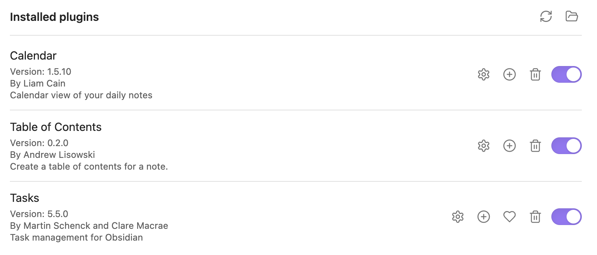

# OS 

I develop on both Linux and macOS. It depends on what I'm working on and how I'm feeling. The project I am working on may require something special. The dual approach to development tests both the portability of my development environment and my ability to recover/rebuild if necesssary. To make switching as less jarring as possible, I use as much of the same tools as and where possible. The only point of friction that tests my muscle memory and my patience is the good old copy/paste keyboard shortcuts between macOS and Linux. 

## Terminal 

On the Mac, I use [iTerm](https://iterm2.com) and have done for many years, although I may give [Alacritty](https://github.com/alacritty/alacritty) a shot at some point.

## Fonts

Hack Nerd Font from [Nerdfonts](https://www.nerdfonts.com/font-downloads).

## Color Theme

I use [Catppucin - Mocha](https://github.com/catppuccin/catppuccin) for the terminal, and Neovim.

## Shell

Throughout my career, I've pretty much used them all: 

- 1990 - 1996 [csh](https://en.wikipedia.org/wiki/C_shell)
- 1997 - 1999 [ksh](https://en.wikipedia.org/wiki/KornShell)
- 2000 - 2015 [bash](https://www.gnu.org/software/bash/)
- 2015 - 2024 [zsh](https://zsh.sourceforge.io) + [Oh My Zsh](https://ohmyz.sh)
- 2024 - Pres [zsh](https://zsh.sourceforge.io) + [Starship](https://starship.rs)

I recently switched to [Starship](https://starship.rs) using the [Gruvbox Rainbow Preset](https://starship.rs/presets/gruvbox-rainbow)

Add these lines towards the end of the ~/.zshrc:

    # Setup command line editing to vim
    bindkey -v
    bindkey ^R history-incremental-search-backward 
    bindkey ^S history-incremental-search-forward

Add this at the very end of the ~/.zshrc file:

    eval "$(starship init zsh)"

Add these aliases to combat 30 years of muscle memory:

    alias vim='nvim'
    alias vi='nvim'

## Miniconda

Used for managing multiple Python projects to avoid dependency conflicts.

[Minoconda](https://docs.anaconda.com/free/miniconda/index.html)

## Neovim

Install/upgrade [Neovim](https://neovim.io) first.

Then, install [kickstart.nvim](https://github.com/nvim-lua/kickstart.nvim). I don't have time to curate, configure and install all the plugins so kickstart gives me a good place to hang out for now.

For the Catppuccin theme, add this to the require('lazy').setup({ block in ~/.config/nvim/init.lua:

    { "catppuccin/nvim", name = "catppuccin", priority = 1000 },

Add these to ~/.config/nvim/init.lua to get relative line numbering and keyboard shortcuts:

    -- Jason's little hacks
    vim.wo.relativenumber = true
    vim.api.nvim_set_keymap('n', '<F1>', ':Telescope find_files<CR>', {noremap = true, silent = true})
    vim.api.nvim_set_keymap('n', '<F2>', ':Telescope buffers<CR>', {noremap = true, silent = true})
    vim.cmd.colorscheme "catppuccin"

For Telescope to work properly, install these separately:

 - [ripgrep](https://github.com/BurntSushi/ripgrep)
 - [fd](https://github.com/sharkdp/fd)

 ## tmux

Visit the [Github page](https://github.com/tmux/tmux/wiki) to download if needed. 

## Docker

I used Docker desktop on macOS. I just use vanilla Docker on Linux.

## Jupyter Notebook

Depending on what I'm working on, I may choose to use Jupyter Notebook (classic not JupyterLab). 

## Obsidian

I've used many notetaking apps over the years. I eventually settled on using Apple Notes, but one day I entered a shopping list on my iMac, then went to the store expecting to find the notes sync'd on my iPhone. It wasn't. Since then, I've been moving away from Notes to Obsidian. I rely on Apple iCloud to sync the vault as I already have a subscription. I gradually moving away from Dropbox too. The plug-ins I use are:

I also turn on vim editing as follows:

