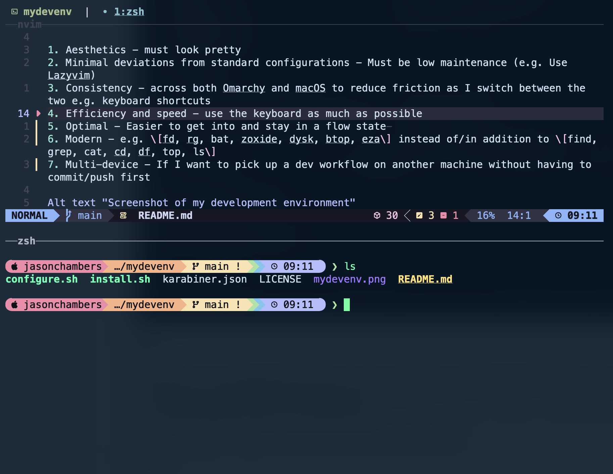

# My Development Environment

Firstly, tools are a personal choice. What works for some may not work for others. If what you use works - that's great. I do encourage you to on occastion, reflect on your developer workflows and invest in how you might make things a little better, a little faster, and maybe a little prettier :-) 

Here's what my development environment looks like, including dot-files and associated install scripts. It's published mostly for myself, but if you find value in it too, that's great.

### Highlights

My development environment has changed quite a lot over the past year. My philosophy is:

1. Aesthetics - must look pretty
2. Minimal deviations from standard configurations - Must be low maintenance (e.g. Use Lazyvim)
3. Consistency - across both Omarchy and macOS to reduce friction as I switch between the two
4. Efficiency and speed - use the keyboard as much as possible
5. Cost - Use Gemini CLI for coding AI assistance (as of time of writing, Gemini has a good balance of performance and value)
6. Optimal - Easier to get into and stay in a flow state 
7. Modern - e.g. fd, rg, bat instead of find, grep, cat
8. Multi-device - If I want to pick up a dev workflow on another machine without having to commit/push first

#### O/S

Omarchy is now my preferred primary OS. I still use macOS for some workflows and when I'm on the road (I don't have a Linux laptop at the moment) and so require consistency for when I need to do some things on macOS. Eventually, I intend to migrate away 
from macOS (after 20 years).

#### IDE

Cursor and VS Code are no longer used. Instead, I use Neovim, Lazygit and Gemini CLI. I've
also introduced lazygit into my workflows.

#### Terminal

I've standardized on Alacritty as it is available on both Omarchy and macOS.

### Conventions

All Git repos are stored in ~/repos. To streamline the process of working across multiple devices, there are certain repos I choose to rely on Dropbox to sync across my devices. This enables me to pick up where I left off on a different device without having to rely on Git. When it comes to my developement environment, changes I make are instantly applied to all my devices automatically.

This is achieved by simply storing these synced repos in my ~/Dropbox/synced_repos folder, and then having a symbolic link in ~/repos.

### Installation (macOS)

On a fresh Mac, first run:

    ./download.sh

Then open up Dropbox and authenticate. Be sure to have synced_repos and Obsidian folder available off-line.

Then run to install configurations:

    ./install.sh

Finally, to fix keyboard mappings for the Razer Ornata keyboard, run this:

    ./mapkeyboard.sh

### Configurations

- [config-tmux](https://github.com/jasondchambers/config-tmux)
- [config-alacritty](https://github.com/jasondchambers/config-alacritty)
- [config-zsh](https://github.com/jasondchambers/config-zsh)
- [config-nvim](https://github.com/jasondchambers/config-nvim)
- [config-lazygit](https://github.com/jasondchambers/config-lazygit)

### Handy utils

- [utils](https://github.com/jasondchambers/utils)
