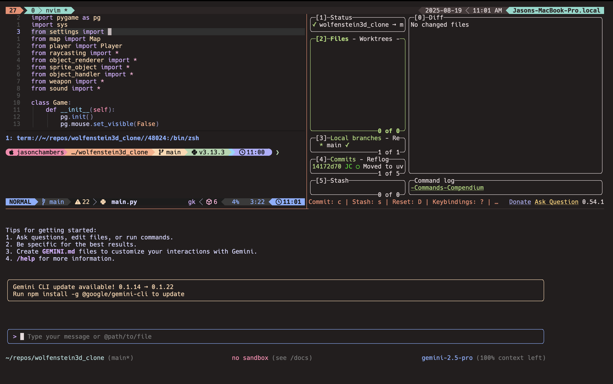

# My Development Environment

### Highlights

My development environment has changed quite a lot over the past year. My philosophy is:

1. Aesthics - must look pretty
2. Minimal deviations from standard configurations - Must be low maintenance (e.g. Use Lazyvim)
3. Consistency - across both Omarchy and macOS
4. Efficiency and speed - use the keyboard as much as possible
5. Cost - Use Gemini CLI for coding AI assistance

#### O/S

Omarchy is now used as my primary OS. I still use macOS for some workflows and so require
consistency for when I need to do some things on macOS. 

#### IDE

Cursor and VS Code are no longer used. Instead, I use Neovim, Lazygit and Gemini CLI. I've
also introduced lazygit into my workflows.

#### Terminal

I've standardized on Alacritty as it is available on both Omarchy and macOS.

### Configurations

[config-tmux](https://github.com/jasondchambers/config-tmux)
[config-alacritty](https://github.com/jasondchambers/config-alacritty)
[config-zsh](https://github.com/jasondchambers/config-zsh)
[config-nvim](https://github.com/jasondchambers/config-nvim)
[config-lazygit](https://github.com/jasondchambers/config-lazygit)

